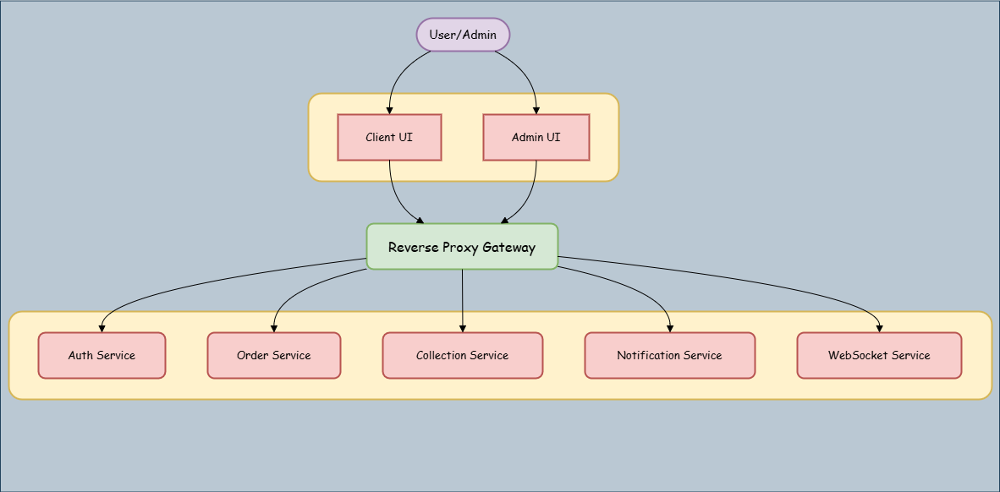

# CricStore — Microservices-Based eCommerce Platform

**CricStore** is a full-stack, microservices-driven eCommerce platform tailored for selling cricket-related items. Built using modern technologies, CricStore features real-time order updates, admin management, scalable architecture with a custom gateway, and deployment using free-tier services to minimize costs.

> This is the **overview documentation** for the project.  
> For individual service details and setup, refer to each linked repository.


> Live URLs:  
> - **Client UI**: [app.cricstore.icu](https://app.cricstore.icu)  
> - **Admin UI**: [admin.cricstore.icu](https://admin.cricstore.icu)  


---

## Architecture Overview

CricStore follows a **microservices architecture** with a central **gateway** to route traffic to internal services:

*Figure: The system architecture shows how users interact with the Client and Admin UIs, which route all requests through a secure reverse proxy gateway. The gateway directs traffic to isolated backend microservices*

---

## Features

### Client Side
- Browse cricket items by category and shops
- Add to cart and checkout
- Real-time order status updates using WebSockets
- User authentication via Supabase
- Responsive and fast UI

### Admin Side
- Admin authentication
- Add, update, or delete products
- Update order status (in real-time for client)
- Dashboard and management views
- Store manager and customer creation

### Auth Service
- Supabase-based user authentication
- JWT for access control
- PostgreSQL as the database

### Order Service
- Handles order creation, status updates
- Publishes order events to Kafka
- MongoDB used as primary database

### Collection Service
- Handles product listings and categories
- MongoDB used for fast and flexible product storage

### Notification Service
- Sends order confirmation and status update emails via [Resend](https://resend.com)
- Listens to Kafka for email-related events

### WebSocket Service
- Enables real-time order status updates to connected clients
- Connected via Kafka consumer

### Custom Reverse Proxy (gateway.cricstore.icu)
- Written in Express.js
- Routes external traffic to internal services
- Avoided expensive EKS clusters by using Render’s free-tier
- Handles service isolation, logging, and path rewriting

---
### Services Overview

| Service                | Repository Link                                                                 |
|------------------------|----------------------------------------------------------------------------------|
| **Client UI**          | [cricstore-client-ui](https://github.com/adarsh-naik-2004/bats-client_ui) |
| **Admin UI**           | [cricstore-admin-ui](https://github.com/adarsh-naik-2004/bats-admin_dashboard)   |
| **Auth Service**       | [cricstore-auth-service](https://github.com/adarsh-naik-2004/bats-auth_service) |
| **Order Service**      | [cricstore-order-service](https://github.com/adarsh-naik-2004/bats-order_service) |
| **Collection Service** | [cricstore-collection-service](https://github.com/adarsh-naik-2004/bats-collection_service) |
| **Notification Service** | [cricstore-notification-service](https://github.com/adarsh-naik-2004/notification_service) |
| **WebSocket Service**  | [cricstore-websocket-service](https://github.com/adarsh-naik-2004/websocket) |
| **Reverse Proxy**      | [cricstore-gateway](https://github.com/adarsh-naik-2004/bats-proxy)     |


## Tech Stack

| Layer               | Technology                             |
|--------------------|----------------------------------------|
| Frontend (Client)  | Next.js, Tailwind CSS, Zustand, SSR    |
| Frontend (Admin)   | React + Vite, Axios                    |
| Backend            | Node.js, Express, Kafka (Confluent)    |
| Authentication     | Supabase, PostgreSQL, JWT              |
| Database           | MongoDB (Collections, Orders)          |
| Email Service      | Resend API                             |
| Real-time          | WebSockets (Node), Kafka Events        |
| Gateway            | Custom Express reverse proxy           |
---

## Kafka Topics

- `product`
- `accessory`
- `order`

All services are connected via **Confluent Kafka**, acting as the event backbone for inter-service communication.

---

## Deployment

| Service             | URL/Host                        |
|---------------------|----------------------------------|
| Client UI           | [app.cricstore.icu](https://app.cricstore.icu) |
| Admin UI            | [admin.cricstore.icu](https://admin.cricstore.icu) |
| Gateway             |  Private Service  |
| Auth-Service        |  Private Service           |
| Order-Service       |  Private Service           |
| Collection-Service  |  Private Service           |
| Notification-Service|  Private Service           |
| WebSocket-Service   |  Private Service           |

---

## Local Development

> Each service has its own README with setup instructions.  
> General steps:

```bash
# Clone all repositories
git clone https://github.com/adarsh-naik-2004/bats-auth_service
git clone https://github.com/adarsh-naik-2004/bats-order_service
git clone https://github.com/adarsh-naik-2004/bats-collection_service
git clone https://github.com/adarsh-naik-2004/notification_service
git clone https://github.com/adarsh-naik-2004/websocket
git clone https://github.com/adarsh-naik-2004/bats-client_ui
git clone https://github.com/adarsh-naik-2004/bats-admin_dashboard
git clone https://github.com/adarsh-naik-2004/bats-proxy


# Setup .env files for each service
# Install dependencies and run:
npm install && npm run dev